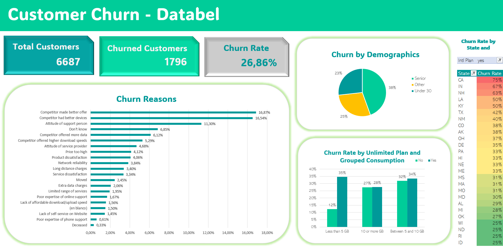

# Customer Churn Analysis (Excel)

## Overview
This project analyzes customer churn for a telecommunications company using Excel. 
The dataset contains information about customer demographics, usage patterns, and reasons for leaving. 
The goal was to identify the churn rate, explore key drivers of customer attrition, and provide actionable recommendations to improve customer retention.

## 🎯Business Questions
- What is the overall churn rate of customers?
- Which demographics (age groups) have the highest churn rates?
- What are the main reasons why customers leave the company?
- How strong is the impact of competitors on churn?

## 💡Analysis
Data cleaning and transformation were performed using Excel functions, including VLOOKUP(), IF(), IF NESTED(), and custom categorizations for age groups and data usage.
Churn rates were calculated across different dimensions: demographics, competitor offers, and service usage.
Visual dashboards were created to highlight churn patterns and allow comparison between customer groups.

## ✅ Results
Total Customers: 6.687
Churned Customers: 1,796
Churn Rate: 26.86%

**Top churn reasons:**
Competitor made a better offer (16.9%)
Competitor had better devices (16.5%)

**Demographics:**
Highest churn among seniors (38%) and customers under 30 (25%).
Churn rate increases significantly with age 69–78 (40%) and 79–88 (44%).

**Geography:**
States like California - CA(75%), Indiana - IN(67%), and New Hampshire -NH(63%) show the highest churn.

## 🧭 Recomendations
1. Competitive offers: Match or improve pricing and device offers to counteract competitor churn.
2. Retention programs for seniors and high-age groups: Since churn increases with age, targeted loyalty discounts or easy-to-use plans can help retain them.
4. Focus on high-churn states (CA, IN, and NH): Investigate local competition and adjust state-specific retention strategies.

## Visualization

